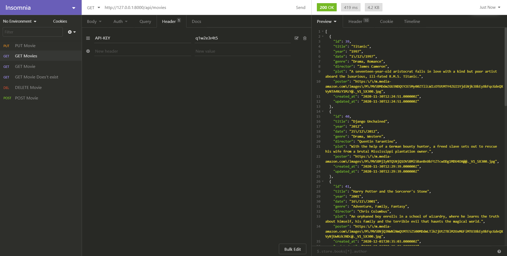
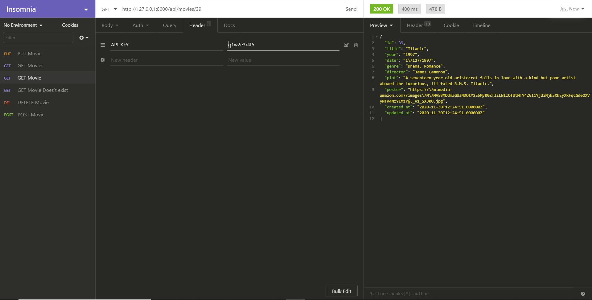
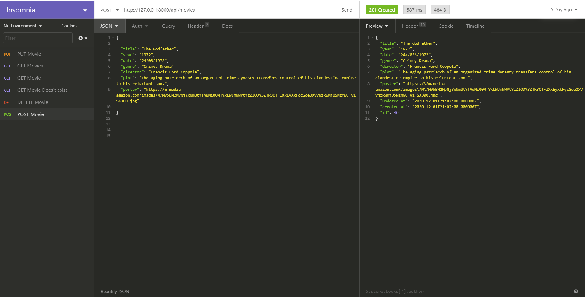
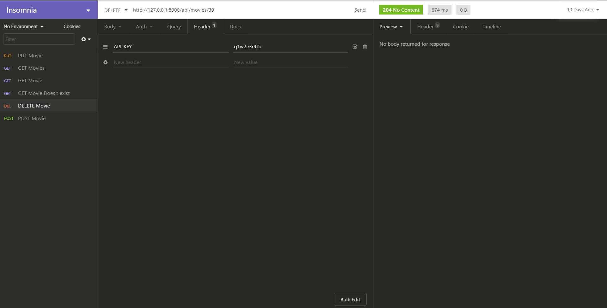
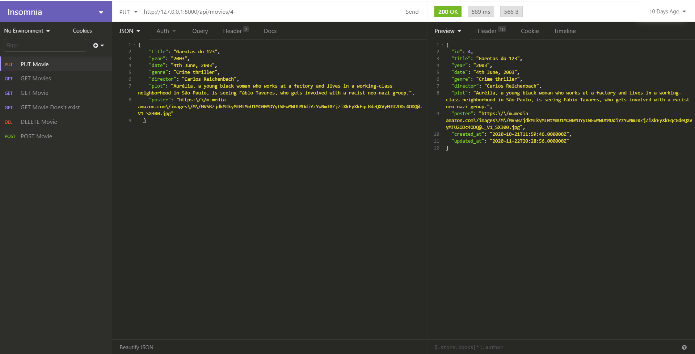

## About this Project

This project is a Movie Database RESTful API I have created as part of my "Advanced Web Technologies" module at Waikato Institute of Technology. (Graduate Diploma in Applied Information Technology, 2019 - 2020)

I have used the most popular PHP framework - **Laravel** to build it along with **SQLite** as the database.

Since it is a RESTful web service, any suitable technologies can be used to consume the API to create a movie application. I have used Angular to create a front-end application by consuming this API which can be found as a separate repository in the below link.

Inorder to create some basic security, I have created a default token which has to be passed through 
the header to access the API movie data. The default API token is **_q1w2e3r4t5_** and its corresponding header is **_API-KEY_**

## Screenshots of testing APIs

## License

This is an open-source project primarily build to learn Web Technologies.************
